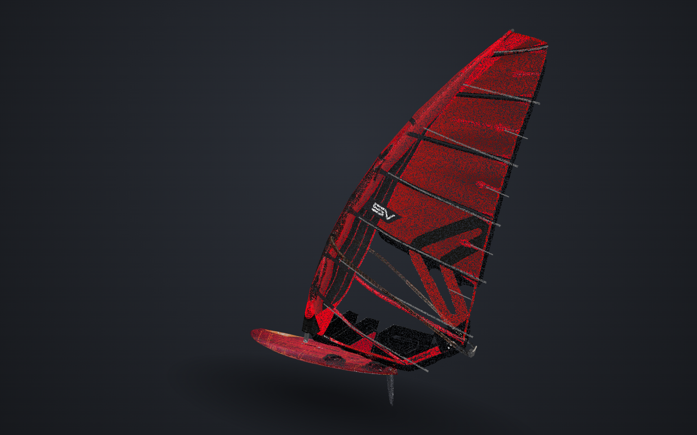

# Severne Mach — 3D Showcase

[](https://winsurfmodel.netlify.app)
[](https://github.com/sponsors/hughes-research)

**[→ Try the live demo](https://winsurfmodel.netlify.app)** — no install required, orbits and loads straight in the browser.

A photorealistic, fully procedural 3D viewer for a Severne Mach slalom windsurf kit — 6.5 m² cambered race sail, mast, wishbone boom, slalom board, and fin — rendered in the browser with [Three.js](https://threejs.org/). There is no 3D-modeled asset anywhere in this project: every mesh is generated from math at load time, and every texture and silhouette is extracted from the manufacturer's own catalog photography. Five PNGs in, one interactive rig out.

This repository is a fork of [hughes-research/windsurf-model](https://github.com/hughes-research/windsurf-model) that adds two features on top of the upstream project: a point-cloud rendering mode — every mesh surface sampled into ~220k colored points, with colors read from the same catalog textures, now the default view — and a one-key binary STL export of the kit. The live-demo badge and links above point at the upstream deploy, which runs the original solid-render version; the fork's features currently run locally (`npm install && npm run dev`).

Drag to orbit, scroll to zoom, and the kit auto-rotates gently when idle — a clean studio presentation built for inspecting a product, not a game or a simulator.

<p align="center">
  <br>
  <sub>The kit as it boots: ~220k surface-sampled points, colors read from the catalog photos, still animated by the wind model.</sub>
</p>

<p align="center">
  <br>
  <sub>The original solid render, one <code>P</code> keypress away — sail, mast, wishbone boom, board, and fin, every mesh generated from math, every texture and silhouette read from a catalog photo.</sub>
</p>

<p align="center">
  
  &nbsp;
  
</p>
<p align="center">
  <sub>Left: batten pockets, camber inducers, and the luff sleeve. Right: the hull bottom and fin, orbited into view from underneath.</sub>
</p>

## Support this project

The work — the code, the photo-to-geometry pipeline, all of it — is free: GPL-licensed, built in the open, no team and no funding behind it. It ran entirely on conversation and LLM tokens. If you'd like to see more of this — more parts finished (footstraps, harness lines), more kits, the technique applied to other product photography — the most direct way to help is covering that token cost: **[sponsor @hughes-research on GitHub](https://github.com/sponsors/hughes-research)**. Every bit of support goes straight back into building the next one.

## Table of contents

- [Support this project](#support-this-project)
- [Quick start](#quick-start)
- [Controls](#controls)
- [Why this exists](#why-this-exists)
- [Project structure](#project-structure)
- [How it works](#how-it-works)
- [Coordinate systems](#coordinate-systems)
- [Required assets](#required-assets)
- [Customization cheat sheet](#customization-cheat-sheet)
- [Documentation](#documentation)
- [Performance](#performance)
- [Browser support](#browser-support)
- [Known limitations](#known-limitations)
- [Tech stack](#tech-stack)
- [License](#license)

## Quick start

Just want to look at the kit? **[winsurfmodel.netlify.app](https://winsurfmodel.netlify.app)** — nothing to install.
(The hosted demo is the upstream project's solid-render version — this fork's point-cloud view and exporters currently run locally.)

To run it locally, requires [Node.js](https://nodejs.org/) 18 or later.

```bash
npm install
npm run dev
```

Open the URL Vite prints — typically `http://localhost:5173`.

| Command | Description |
|---|---|
| `npm install` | Install dependencies (Three.js, Vite) |
| `npm run dev` | Start the dev server with hot module reload |
| `npm run build` | Production build to `dist/` |
| `npm run preview` | Serve the production build locally, to sanity-check the build before deploying |

The app is a static site once built — `dist/` can be hosted anywhere that serves plain files (no server-side code, no API, no database).

## Controls

| Input | Action |
|---|---|
| Click + drag | Orbit the camera around the kit |
| Scroll / pinch | Zoom in and out (clamped 2.5 m – 14 m from the target) |
| `P` | Toggle point-cloud ↔ original solid render (point cloud is the default) |
| `E` | Download the kit as a binary STL (meters, world-space; open surfaces — not watertight for printing) |
| `G` | Download the kit as a binary glTF (.glb) with materials and textures embedded |
| Idle for 3 seconds | Camera resumes a slow auto-rotate |
| Window resize | Camera automatically re-frames the whole kit |

Orbiting is unlocked far enough to swing underneath the board and inspect the hull bottom, fin, and boom from below — the polar angle is *not* clamped to a hemisphere the way most product viewers are.

## Why this exists

This project started as a question: can you build a convincing, riggable 3D product model from nothing but the same catalog photos a manufacturer already publishes — no photogrammetry, no 3D scanning, no modeling software — and have every dimension be *correct*, not just plausible?

The answer turned out to be yes, provided two things are true: the photos have to be scanned programmatically rather than traced by hand (so the geometry inherits the photo's real proportions instead of an artist's guess), and the fine rigging details — mast rake, boom height, batten slope, camber inducer positions — have to come from someone who actually knows how the physical object is trimmed. The code supplies precision; the domain expert supplies truth. Neither one is sufficient alone. See [`docs/PHOTO_TO_GEOMETRY.md`](docs/PHOTO_TO_GEOMETRY.md) for the reusable technique this produced, and [`docs/SAIL_RIGGING.md`](docs/SAIL_RIGGING.md) for how ~30 rounds of "move the boom up 15 cm" turned into a sail that actually looks rigged.

## Project structure

```text
windsurf-model/
├── index.html                          Entry page: dark studio backdrop, caption, <script type="module">
├── 026-Mach-9-render-final-lr-1.png    Sail catalog render — texture + silhouette (source of truth for the sail)
├── board_bottom.png                    Top-down hull-bottom photo — texture for the underside of the board
├── boom.png                            Top-down boom photo — texture + arm shape for the wishbone
├── fin_texture.png                     Side-on fin photo — blade outline (sweep included) + carbon texture
├── src/
│   ├── main.js                         Renderer, lights, scene assembly, camera, OrbitControls, animation loop
│   ├── util.js                         loadAndScan() (alpha silhouette scanner), smoothLuffX(), interp1() spline, taperedTube()
│   ├── sailImage.js                    Scans the sail render → luff/leech curves, clew height, UV mapping
│   ├── sail.js                         Parametric cloth surface: draft, twist, cams, battens, luff sleeve, wind simulation
│   ├── boomImage.js                    Scans the boom photo → left/right arm centerlines + thickness, UV texture
│   ├── hardware.js                     Mast stub, wishbone boom, head/tail blocks, outhaul rope, mast foot
│   ├── boardImage.js                   Scans deck + bottom photos → board outline, deck UVs, warped bottom texture
│   ├── board.js                        Lofted superellipse hull, deck/hull materials, lofted fin blade
│   ├── finImage.js                     Scans the fin photo → leading/trailing edge curves, UV mapping
│   └── board_map.png                   Top-down deck photo — outline + deck texture
├── docs/
│   ├── ARCHITECTURE.md                 System design: module graph, data flow, scene graph, rendering pipeline
│   ├── PHOTO_TO_GEOMETRY.md            The core reusable technique — turning a product photo into 3D geometry + UVs
│   ├── SAIL_RIGGING.md                 The parametric sail model in full: every constant, what it does, how it was measured
│   ├── TROUBLESHOOTING.md              Gotchas hit during development, with symptom → cause → fix
│   ├── DEVELOPMENT.md                  Dev workflow, verification loop, code conventions, how to extend the project
│   └── superpowers/specs/              Original design spec from project kickoff
├── package.json
└── vite.config (implicit — no vite.config.js; Vite's zero-config defaults are used)
```

`026-Mega-render-final-lr-600-1.png` is present in the repo but not imported by any module — a leftover reference image, safe to ignore or delete.

## How it works

Every visible part of the kit is built the same way: **scan a photo → derive a parametric shape → loft geometry along that shape → texture it with the same photo.** No two parts share modeling code, but they all share this pipeline.

```text
PNG (alpha channel)
   │
   ▼
loadAndScan()  ──►  per-row left/right edge in pixels
   │
   ▼
shape descriptor  ──►  {  widthAt(t), luffX(u), edgeAt(u), uvFor(...)  }
   │                     (pure functions closing over the scanned pixel data)
   ▼
geometry builder  ──►  THREE.BufferGeometry (custom vertex loops, not primitives)
   │
   ▼
THREE.Mesh(geometry, material)  ──►  material.map = the same source photo
```

The **sail** gets the deepest treatment — on top of its scanned 2D outline, `sail.js` adds a full 3D camber model: draft depth, chordwise profile (flat entry behind the sleeve, swept up to max draft, eased to the leech), five hard camber inducers plus one soft one, a sloped batten grid with round rod geometry, four leech mini-battens, a luff sleeve that swallows the mast, and a live wind simulation — a gust signal opens and closes the leech in waves that travel up the sail, panels breathe between battens, flutter grows with wind strength, and all of it damps to zero exactly at each batten rod (which ride the moving cloth). The **board** is a lofted superellipse hull whose outline and both textures (deck and bottom) come from two photos warped into a shared UV frame. The **boom** traces both wishbone arms directly from a top-down photo's pixel data. See [`docs/ARCHITECTURE.md`](docs/ARCHITECTURE.md) for the full module graph and scene assembly, and [`docs/PHOTO_TO_GEOMETRY.md`](docs/PHOTO_TO_GEOMETRY.md) for the scanning technique itself.

## Coordinate systems

Three independent local coordinate systems exist, composed in `main.js` via nested `THREE.Group`s:

| Space | Parameterization | Notes |
|---|---|---|
| **Sail / rig** | `u` = 0 at the tack → 1 at the head, along the luff. `v` = 0 at the luff → 1 at the leech, across the chord. World axes: **y** = height, **x** = chord, **z** = draft (belly bulges toward +z). | Tack sits at the local origin; the mast foot is a small negative-y offset below it. |
| **Board** | `t` = 0 at the tail (image bottom) → 1 at the nose (image top). `s` = 0 → 1 across the width at each station. World axes: **y** = 0 at the bottom rocker line, **x**: tail at +x, nose at −x, mast track at x = 0. | Board-local +x deliberately matches the clew side of the rig, so rig rake and board tail point the same direction. |
| **Boom** | `d` = pixels behind the boom's front edge (image top = mast clamp). Left/right arms tracked independently as `{ centerPx, radiusPx }` per row. | Converted to meters via `metersPerPixel = boomLengthMeters / boomLengthPixels`, computed once the boom is scaled against the sail's scanned clew position. |

`main.js` composes them as: `kit` (floats above the shadow) → `rigPivot` (rake rotation + mast-track offset, in board space) → `rig` (tack-to-deck gap) → `sail` mesh + `hardware` group (in sail/rig space).

## Required assets

Five PNGs, all with clean alpha channels, must be present for the app to build a kit. Nothing is bundled with the repo as a placeholder — swap these to re-skin the whole model.

| File | Location | Dimensions | Drives |
|---|---|---|---|
| `026-Mach-9-render-final-lr-1.png` | repo root | 800 × 1478 | Sail silhouette, luff/leech curves, clew height, all sail texture (including the translucent window, via alpha) |
| `src/board_map.png` | `src/` | 217 × 786 | Board outline, width profile, deck texture |
| `board_bottom.png` | repo root | 219 × 789 | Hull-bottom texture (warped into the deck photo's UV frame) |
| `boom.png` | repo root | 106 × 354 | Both wishbone arm shapes and the boom's top/bottom texture |
| `fin_texture.png` | repo root | 266 × 900 | Fin blade outline — leading/trailing edges with the aft sweep — and the carbon texture, both sides |

Alpha edges should be clean (no soft drop shadow baked into the alpha) — the scanner uses a fixed alpha threshold of 20/255 per pixel, chosen so the sail's translucent window (~alpha 27) still reads as "inside the sail" without pulling in stray shadow pixels. See [`docs/PHOTO_TO_GEOMETRY.md`](docs/PHOTO_TO_GEOMETRY.md#preparing-a-source-photo) before substituting your own photos.

## Customization cheat sheet

| I want to... | Edit | What to change |
|---|---|---|
| Swap the sail graphic entirely | `src/sailImage.js` | The `sailUrl` import — new photo must have transparent background and be shot square-on |
| Change sail size / proportions | `src/sailImage.js` | `HEIGHT` constant (rigged luff length, meters) |
| Move a batten | `src/sail.js` | `BATTENS` array — `{ u, du }` = luff-end position, leech-end drop |
| Add/remove camber inducers | `src/sail.js` | `CAMS` (hard cams) / `SOFT_CAM` (soft cam) — both derive from `BATTENS`, so move the batten first |
| Change draft depth or entry shape | `src/sail.js` | `DRAFT_PTS` (depth by height) / `PROFILE_PTS` & `CAM_PROFILE_PTS` (chordwise shape) |
| Change the wind / flutter response | `src/sail.js` | `gustAt()` (gust signal), the twist/belly modulation coefficients and `flutterAmp` in `update()` |
| Re-rake the rig | `src/main.js` | `RIG_RAKE` (radians, negative = aft) |
| Move the mast foot on the track | `src/main.js` | `rigPivot.position.set(x, DECK_AT_TRACK, 0)` — x is fore/aft offset in meters |
| Change tack-to-deck gap | `src/main.js` | `rig.position.y` |
| Retrim the boom | `src/hardware.js` | `yAt()` height curve, and the endpoint constants near `head`/`tail` block placement |
| Resize the board | `src/board.js` | `LEN`, `TAIL_X`, `THICK_PTS`, `ROCKER_PTS` |
| Swap or resize the fin | `src/finImage.js` / `src/main.js` | The `finUrl` import (side-on photo, base at top), and the `depth` argument to `loadFinShape()` (default 0.4 m) |
| Change studio lighting | `src/main.js` | `key`/`rim` `DirectionalLight`s, `scene.environmentIntensity` |
| Change camera framing | `src/main.js` | `frameKit()`, `controls.target`, `camera.fov` |

For anything involving photo-derived numbers (batten positions, draft profile), don't guess — measure it from the source PNG the way [`docs/SAIL_RIGGING.md`](docs/SAIL_RIGGING.md#measuring-features-from-a-photo) describes. Eyeballing pixel coordinates from a screenshot is how the batten positions ended up wrong three times during development.

## Documentation

| Document | Covers |
|---|---|
| [`docs/ARCHITECTURE.md`](docs/ARCHITECTURE.md) | Module dependency graph, data flow, scene graph, rendering pipeline, performance profile |
| [`docs/PHOTO_TO_GEOMETRY.md`](docs/PHOTO_TO_GEOMETRY.md) | The reusable photo-scanning technique: alpha silhouette extraction, UV strategies, texture-matte tricks, when to use each pattern |
| [`docs/SAIL_RIGGING.md`](docs/SAIL_RIGGING.md) | The parametric sail model constant-by-constant, plus the methodology for measuring rigging features from a photo |
| [`docs/TROUBLESHOOTING.md`](docs/TROUBLESHOOTING.md) | Every real bug hit during development, as symptom → root cause → fix → general lesson |
| [`docs/DEVELOPMENT.md`](docs/DEVELOPMENT.md) | Dev workflow, the visual verification loop, code conventions, how to add a new photo-mapped part |

## Performance

- **Draw calls**: on the order of 25 meshes total (one sail cloth mesh, two batten-rod tubes per batten × 7 + 4 mini-battens, one sleeve, two boom-arm tubes, two outhaul strands, several small hardware primitives, one two-material board hull, one fin).
- **Heaviest mesh**: the sail cloth is a 260 × 36 vertex grid (~9,500 vertices) — deliberately fine along the luff direction to resolve the batten pocket ridges and the camber-to-flat profile transition without visible faceting.
- **Per-frame cost**: the wind simulation rewrites the sail's Z positions (cloth + batten-rod rings) and calls `computeVertexNormals()` on the cloth every frame — the only steady-state CPU cost in the render loop. Everything else (board, hardware, boom) is static geometry built once at load.
- **Textures**: four source photos plus two canvas-composited derivatives (bottom-hull warp, boom photo-over-matte) — all well under 1 MB combined, and none are procedurally regenerated after load.
- **Pixel ratio** is capped at 2 regardless of device pixel ratio, to bound fragment shader cost on high-DPI displays.

## Browser support

Requires WebGL2 (via Three.js's `WebGLRenderer`) and ES modules. Tested against current Chrome/Chromium. `RoomEnvironment` PMREM generation and `MeshPhysicalMaterial` clearcoat are both standard Three.js features with broad support; no experimental APIs are used.

## Known limitations

- The board's thickness and rocker curves (`THICK_PTS`, `ROCKER_PTS` in `board.js`) are estimated, not scanned — only the plan-view outline and textures are photo-derived. The fin's thickness profile is likewise hand-tuned; its outline and texture come from the photo.
- At grazing viewing angles the sail's clearcoat can read as a silvery sheen on the reverse side, slightly washing out the print.
- No configurator, spec hotspots, or water/environment scene — this is a clean studio product shot, not a full marketing site (see the [design spec](docs/superpowers/specs/) for what was deliberately scoped out).

## Tech stack

- [Three.js](https://threejs.org/) `^0.172.0` — the only runtime dependency
- [Vite](https://vitejs.dev/) `^6.0.7` — dev server and bundler, zero-config
- Plain JavaScript (ES modules), no framework, no build-time type system, no CSS framework

## License

**Code**: [GNU General Public License v3.0 or later](LICENSE) — free as in speech *and* free as in beer. Use, study, modify, and redistribute it, including commercially, as long as derivative works stay under GPL-3.0-or-later too (copyleft) and you keep the license and copyright notice attached.

**Assets**: the five source photographs (`026-Mach-9-render-final-lr-1.png`, `src/board_map.png`, `board_bottom.png`, `boom.png`, `fin_texture.png`) and the Severne/Select names and branding are **not** covered by the GPL grant above — they belong to their respective owner and are used here for a non-commercial demonstration of the modeling technique. The GPL applies to the JavaScript, HTML, and documentation in this repository, not to the third-party product photography it happens to load.
